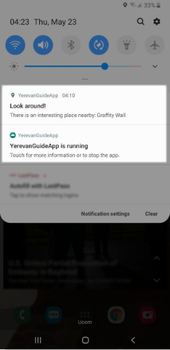
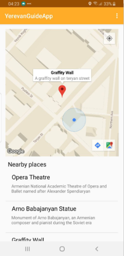
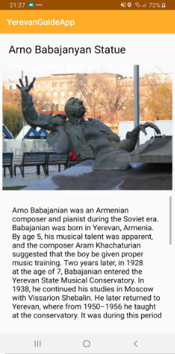

# PEG
Personal Electronic Guide - a prototype android app project for tourism in Armenia I developed as a Bachelor's degree work. The goal was to make an app that acts like a buddy as you walk around the cities, sending you relevant information about places you might be interested in, like cultural monuments, galleries and whatever suits your preference, and ping you, if you pass by one so you don't miss out! 
  

## Objectives
- Build an app that feels more like a natural side-by-side guide
- Provide live guidance even outside the app to ensure the user doesn't miss out
- Offer a personalized itenerary for users based on their preferences 

## Key Features
- **Real-time guide:** Tracking the user's location in real time on an interactive map.
- **Smart recommendations:** The application's reaction (in the form of a notification or audio recording) when the user comes close to an interesting place.
- **Personalized experience:** The ability to set preferences and notifications about places of interest.
- **Cultural Insights:** Full information about landmarks you can find by clicking on it on the map.

## Tools used
- Java for Android development
- XML for ui templates
- Google Maps API for navigation
